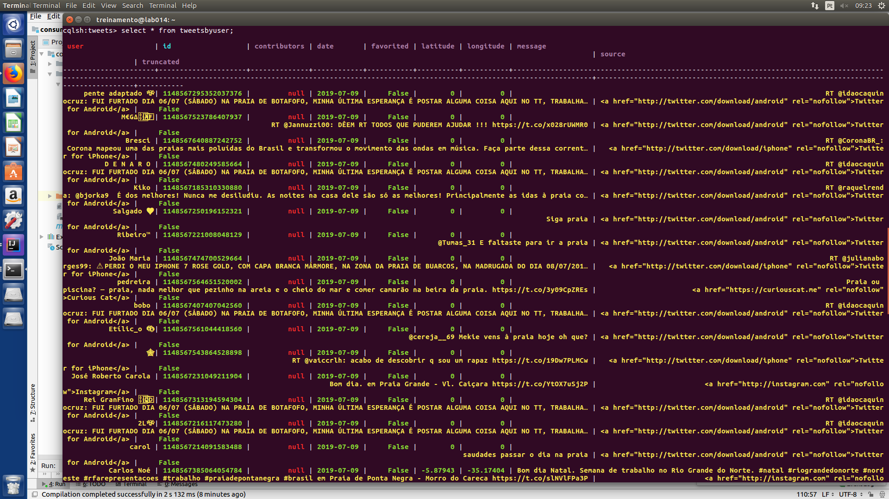

# Projeto Final da Disciplina INF1802 - Big Data & Streaming

## Integração entre Cassandra e Kafka

Tópico dos tweets: tweets_topic
Para criá-lo:
```
kafka-topics --zookeeper $KAFKA_ZOOKEEPER_CONNECT --create --topic tweets_topic --partitions 3 --replication-factor 1
```

Antes de rodar o produtor, colocar as chaves do Twitter como variáveis de ambiente do projeto!
```
TWITTER_CONSUMER_KEY
TWITTER_CONSUMER_SECRET
TWITTER_ACCESS_TOKEN
TWITTER_ACCESS_TOKEN_SECRET
```

Caso haja erro com as trustAnchors, lembrar de adicionar o seguinte parâmetro nas configurações do programa (era necessário nas máquinas de treinamento):
```
-Djavax.net.ssl.trustStore=/etc/ssl/certs/java/cacerts
```

Após rodar o produtor e o consumidor, iniciar através de:
```
curl http://localhost:8080/tweets/collector
curl http://localhost:9080/tweets/consumer
```

Com ambos rodando, é possível conferir no Cassandra se os tweets estão sendo adicionados. Para rodar o Cassandra (assumindo que o nome do container seja "cassandra-db"):
```
docker exec -it cassandra-db /bin/bash
cqlsh
```

Assim, estaremos no Cassandra. Neste projeto, foi criado o keyspace "tweets" e é preenchida a tabela "tweetsByUser", então todos os valores inseridos estarão nessa tabela.
```
use tweets;
select * from tweetsByUser;
```

Um exemplo de resultado é o da imagem abaixo:


